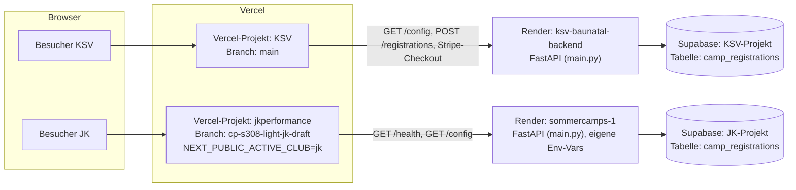

# System-Architektur — Überblick

> Kompakte technische Übersicht. Für Details zu Datenfluss, DB-Schema und Konventionen siehe
> [`CLAUDE.md`](../../CLAUDE.md); für Deployment-Konfiguration siehe [`DEPLOYMENT.md`](../../DEPLOYMENT.md).

## Ein Repository, zwei Vercel-Projekte, zwei Backends

Es gibt **ein** Git-Repository, aber **zwei getrennte Vercel-Projekte** (die jeweils denselben
Frontend-Code bauen, nur mit unterschiedlicher Konfiguration) und seit JK-102 auch **zwei
getrennte Backend/DB-Instanzen**:

| | Vercel-Projekt | Branch | Frontend-Konfiguration | Backend (Render) | DB (Supabase) |
|---|---|---|---|---|---|
| KSV Baunatal | KSV-Projekt | `main` | Standard (kein `NEXT_PUBLIC_ACTIVE_CLUB` gesetzt) | `ksv-baunatal-backend` | KSV-Projekt |
| JK Performance Academy | `jkperformance` | `cp-s308-light-jk-draft` | `NEXT_PUBLIC_ACTIVE_CLUB=jk` | `sommercamps-1` | eigenes JK-Projekt |

## Frontend-Konfigurationsauswahl über `NEXT_PUBLIC_ACTIVE_CLUB`

Beide Auftritte sind **derselbe Next.js-Code**. Welcher Verein angezeigt wird, entscheidet
ausschließlich die Build-Zeit-Umgebungsvariable `NEXT_PUBLIC_ACTIVE_CLUB`:

- **Unset oder jeder Wert außer `"jk"`** → `frontend/app/lib/clubConfig.tsx` liefert die
  KSV-Defaults (Name, Preise, Camps, Rechtstexte, Formular).
- **`"jk"`** → dieselbe Datei liefert stattdessen die Werte aus
  `frontend/app/lib/clubConfig.jk.tsx` (Overrides für Name, Programme, Slideshow, FAQ etc.).

Es gibt keine Laufzeit-Umschaltung und keine URL-/Domain-basierte Unterscheidung — die
Entscheidung fällt einmalig beim Build in Vercel.

## Backend und Datenbank sind seit JK-102 vollständig getrennt

Bis JK-102 waren Backend (Render) und Datenbank (Supabase) zwischen KSV und JK geteilt. Das ist
jetzt aufgelöst:

- Zwei FastAPI-Services (`ksv-baunatal-backend`, `sommercamps-1`), zwei `DATABASE_URL`s, zwei
  unabhängige Admin-Logins (`ADMIN_PASSWORD`), zwei Supabase-Projekte.
- Beide laufen von **derselben Codebase** (`main.py`) — Unterscheidung ausschließlich über
  Env-Vars (`CLUB_NAME`, `CLUB_SUBTITLE`, `CAMP_YEAR`, `CLUB_LEGAL_NAME`, `DATABASE_URL`, ...).
- Die Tabelle `camp_registrations` hat weiterhin **kein** `club_id`/`organization_id`-Feld — die
  Trennung ist Infrastruktur-Isolation, kein Multi-Tenant-Datenmodell (siehe unten).
- `GET /config` liefert pro Backend jetzt seinen eigenen, unabhängigen Wertesatz (verifiziert:
  JK liefert `club_name: "JK Performance Academy"`, nicht mehr die KSV-Werte).

## JK hat weiterhin keinen produktiven Schreibpfad

Die JK-Landingpage ist weiterhin reine Vorschau/Marketing — JK-102 hat nur die Infrastruktur
isoliert, keinen echten Formular-Flow gebaut (das ist JK-104):

- Es gibt **kein** Anmelde- oder Anfrageformular, das Daten an das Backend sendet.
- "Trainingsanfrage stellen" und "Interesse an Mitgliedschaft" sind `mailto:`-Links, keine
  API-Calls.
- Der einzige Backend-Kontakt von JK aus ist weiterhin der lesende `GET /config`-Aufruf —
  jetzt aber gegen den eigenen, isolierten JK-Service statt gegen KSV.
- Es entstehen dadurch weiterhin **keine** JK-Datensätze — auch nicht in der neuen JK-DB.

## Abgeschlossen: isolierte JK-Infrastruktur (JK-102)

Paket und Preis sind mit Jan final bestätigt. JK ist **von KSV vollständig isoliert**: eigenes
Supabase-Projekt, eigener Render-Service (`sommercamps-1`), eigene Env-Vars — kein geteilter
Tenant-Zustand mehr. Verifiziert über `/health` (200, DB erreichbar) und `/config` (200,
liefert JK-eigene Werte). Schritt-für-Schritt-Anleitung, inkl. Rollback:
[`docs/onboarding/jk-infrastructure-setup.md`](../onboarding/jk-infrastructure-setup.md).

## Ausdrücklich keine Behauptung

Dieses Dokument beschreibt den **tatsächlichen** Stand, nicht das Zielbild:

- Es gibt **kein** echtes Multi-Tenant-System (keine `organizations`-Tabelle, keine
  Row-Level-Security-basierte Mandantentrennung).
- Die Trennung KSV/JK ist ausschließlich ein **Frontend-Content-Switch zur Build-Zeit**.
- Die vollständige Multi-Tenant-Roadmap (Phasen 1–5) steht in [`CLAUDE.md`](../../CLAUDE.md#roadmap-5-phasen-richtung-multi-tenant-saas).
