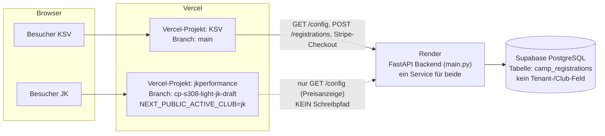

# System-Architektur — Überblick

> Kompakte technische Übersicht. Für Details zu Datenfluss, DB-Schema und Konventionen siehe
> [`CLAUDE.md`](../../CLAUDE.md); für Deployment-Konfiguration siehe [`DEPLOYMENT.md`](../../DEPLOYMENT.md).

## Ein Repository, zwei Vercel-Projekte

Es gibt **ein** Git-Repository und **ein** FastAPI-Backend, aber **zwei getrennte Vercel-Projekte**,
die jeweils denselben Frontend-Code aus diesem Repository bauen — nur mit unterschiedlicher
Konfiguration:

| | Vercel-Projekt | Branch | Frontend-Konfiguration |
|---|---|---|---|
| KSV Baunatal | KSV-Projekt | `main` | Standard (kein `NEXT_PUBLIC_ACTIVE_CLUB` gesetzt) |
| JK Performance Academy | `jkperformance` | `cp-s308-light-jk-draft` | `NEXT_PUBLIC_ACTIVE_CLUB=jk` |

## Frontend-Konfigurationsauswahl über `NEXT_PUBLIC_ACTIVE_CLUB`

Beide Auftritte sind **derselbe Next.js-Code**. Welcher Verein angezeigt wird, entscheidet
ausschließlich die Build-Zeit-Umgebungsvariable `NEXT_PUBLIC_ACTIVE_CLUB`:

- **Unset oder jeder Wert außer `"jk"`** → `frontend/app/lib/clubConfig.tsx` liefert die
  KSV-Defaults (Name, Preise, Camps, Rechtstexte, Formular).
- **`"jk"`** → dieselbe Datei liefert stattdessen die Werte aus
  `frontend/app/lib/clubConfig.jk.tsx` (Overrides für Name, Programme, Slideshow, FAQ etc.).

Es gibt keine Laufzeit-Umschaltung und keine URL-/Domain-basierte Unterscheidung — die
Entscheidung fällt einmalig beim Build in Vercel.

## Geteiltes Backend und geteilte Datenbank (Stand heute)

Backend (Render) und Datenbank (Supabase) sind **vollständig geteilt** zwischen KSV und JK:

- Ein FastAPI-Service, eine `DATABASE_URL`, ein Admin-Login (`ADMIN_PASSWORD`).
- Die Tabelle `camp_registrations` hat **kein** `club_id`/`organization_id`-Feld — es gibt im
  Backend/DB-Schema aktuell kein Konzept von "mehreren Kunden".
- `GET /config` (Camp-Preis, Altersgrenzen) wird von beiden Frontends abgefragt, liefert aber
  nur einen einzigen, globalen Wertesatz — de facto den von KSV konfigurierten.

## JK hat aktuell keinen produktiven Schreibpfad

Die JK-Landingpage ist reine Vorschau/Marketing:

- Es gibt **kein** Anmelde- oder Anfrageformular, das Daten an das Backend sendet.
- "Trainingsanfrage stellen" und "Interesse an Mitgliedschaft" sind `mailto:`-Links, keine
  API-Calls.
- Der einzige Backend-Kontakt von JK aus ist der lesende `GET /config`-Aufruf.
- Es entstehen dadurch **keine** JK-Datensätze in der (KSV-)Datenbank.

## Geplant: isolierte JK-Infrastruktur (Track B)

Sobald JK ein Paket mit echtem Anfrage-Flow bestätigt (siehe `docs/onboarding/jk-implementation-plan-after-yes.md`
— liegt aktuell nur auf Branch `cp-s308-light-jk-draft`, noch nicht auf `main`, daher hier
ohne Link), ist als nächster Schritt eine **von KSV komplett isolierte** Infrastruktur
vorgesehen: eigenes Supabase-Projekt, eigener Render-Service, eigene Env-Vars — kein
geteilter Tenant-Zustand. Diese Trennung existiert **noch nicht**, sie ist Planungsstand.

## Ausdrücklich keine Behauptung

Dieses Dokument beschreibt den **tatsächlichen** Stand, nicht das Zielbild:

- Es gibt **kein** echtes Multi-Tenant-System (keine `organizations`-Tabelle, keine
  Row-Level-Security-basierte Mandantentrennung).
- Die Trennung KSV/JK ist ausschließlich ein **Frontend-Content-Switch zur Build-Zeit**.
- Die vollständige Multi-Tenant-Roadmap (Phasen 1–5) steht in [`CLAUDE.md`](../../CLAUDE.md#roadmap-5-phasen-richtung-multi-tenant-saas).
